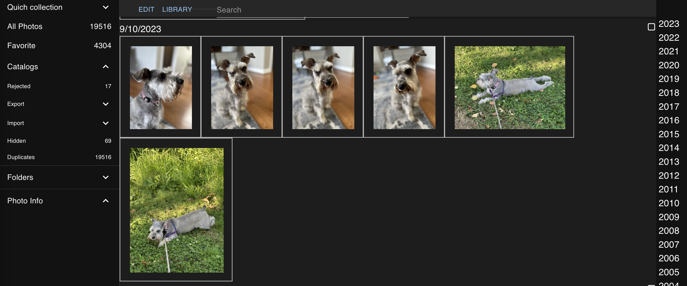

# Kouki2 - your unopinionated photo librarian

Kouki2 is a photo library management software designed to manage photos which you have on your local disk.

I've been using Lightroom for photo management since Lightroom v1. As I moved to take more and more photos using my phone, I realized that I do not use Lightroom editing features that much. And the features which I would like to have such as deep integration with the phone are missing. After looking at a number of alternatives such as Apple Photo, Google photo, Photoprism, Librephotos or Photosync, I could not find an app which fits my workflow.

Kouki2 is build around following key features:

- Experience centered around camera roll view. [Camera roll](https://github.com/alexezh/kouki2/wiki/CameraRoll)
- Full text search based on ML technologies
- Import/export and quick collection with history. [Collection with history](https://github.com/alexezh/kouki2/wiki/Collections-with-history)
- Light weight publishing. [Export folders](https://github.com/alexezh/kouki2/wiki/Export-folders)
- Coming soon. Support for external editor - use whatever tool you want for editing photos. Kouki2 will save versions of photos as needed.
- Coming soon. One click transfer from and to phone. [Phone integration](https://github.com/alexezh/kouki2/wiki/Phone)

[]

Installation instructions can be found [here](https://github.com/alexezh/kouki2/wiki/Installation). List of pending items is [here]([web](https://github.com/alexezh/kouki2/)https://github.com/alexezh/kouki2/web/todo.md)

